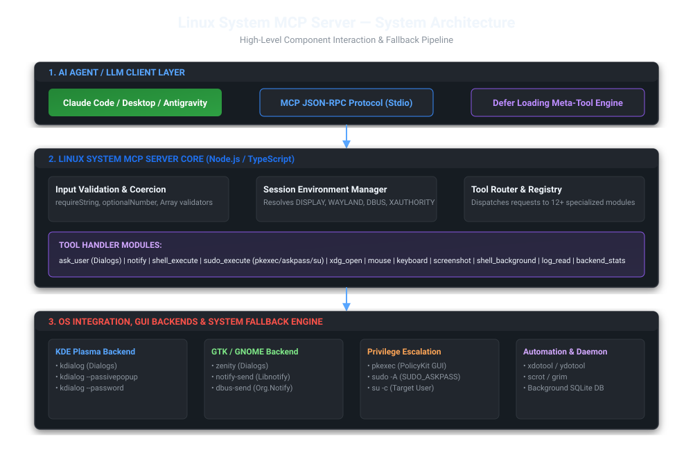
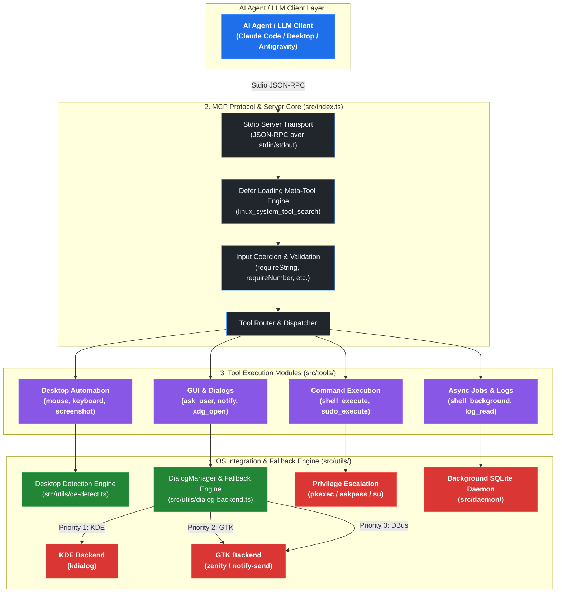
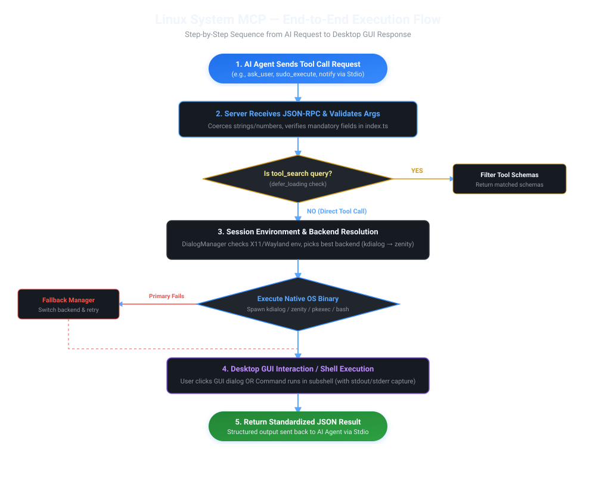
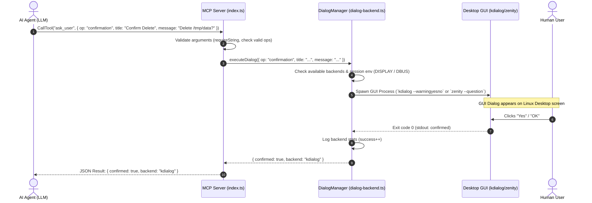
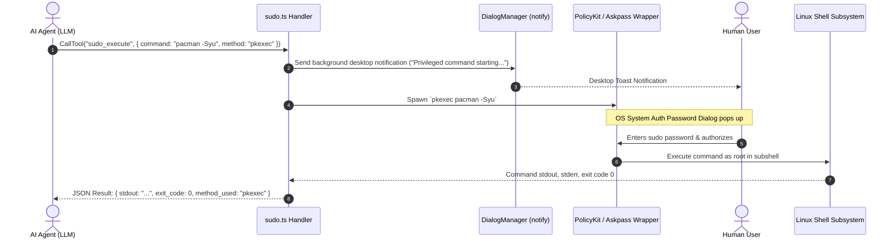
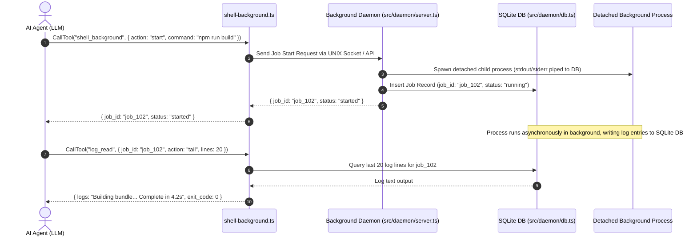
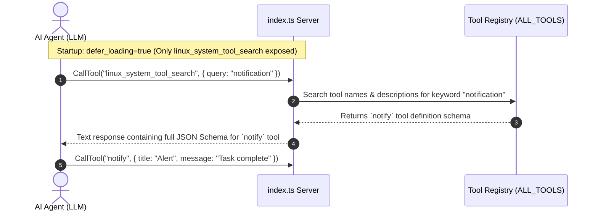

# 🐧 Linux System MCP Server — Complete Architecture & Execution Flow

> **Version:** 1.0.0  
> **Repository:** `linux_system_mcp`  
> **Maintainer:** DGPL (Durbhasi Gurukulam Private Limited)  
> **Specification:** Model Context Protocol (MCP) Stdio Server for Linux Desktop Integration

---

## 📐 1. System Architecture Overview

The **Linux System MCP Server** acts as an intelligent, high-performance bridge between AI Agents (such as Claude Code, Claude Desktop, Antigravity) and the Linux Desktop Environment. It translates high-level structured MCP tool requests into native Linux Desktop GUI dialogs, system notifications, shell commands, automated inputs, and privileged operations.

### High-Level System Architecture Diagram





---

## 🏗️ 2. Core Architectural Subsystems

### 2.1 Protocol Transport & Defer Loading Engine (`src/index.ts`, `src/config.ts`)
- **Transport Layer**: Utilizes `StdioServerTransport` from `@modelcontextprotocol/sdk` to establish a bi-directional JSON-RPC channel over stdio streams.
- **Token-Saving Defer Loading (`defer_loading`)**:
  - By default, to save LLM context window tokens during initial system prompts, the MCP server registers **only one meta-tool**: `linux_system_tool_search`.
  - When the LLM calls `linux_system_tool_search`, the server searches `ALL_TOOLS` by keyword and returns the exact schemas of matching tools on demand.
  - Can be toggled to expose all schemas directly by setting environment variable `defer_loading=false`.
- **Robust Argument Coercion**:
  - LLMs frequently send numeric or boolean arguments wrapped as strings (e.g., `"timeout": "30"`).
  - The validation helpers (`requireString`, `optionalNumber`, `optionalBoolean`, `requireStringArray`) automatically validate and coerce primitive types before passing arguments to underlying system handlers.

---

### 2.2 Desktop Environment & Session Environment Resolver (`src/utils/de-detect.ts`, `src/utils/dialog-backend.ts`)
- **Session Environment Injection (`resolveSessionEnv`)**:
  - When spawned by headless background processes or AI agents, standard desktop environment variables (`DISPLAY`, `WAYLAND_DISPLAY`, `DBUS_SESSION_BUS_ADDRESS`, `XAUTHORITY`) might be missing.
  - The session environment resolver scans `/proc` and active desktop socket paths to recover and cache these critical environment variables, ensuring GUI dialogs render seamlessly on the user's active display server.
- **Desktop Environment Detection (`getDialogBackend`)**:
  - Auto-detects desktop environment: **KDE Plasma**, **GNOME**, **XFCE**, **Cinnamon**, **MATE**, **LXQt**, **Hyprland**, **Sway**, or **i3**.
  - Audits binary availability using `which`: `kdialog`, `zenity`, `notify-send`, `dbus-send`, `pkexec`, `sudo`, `su`, `xdotool`, `ydotool`, `scrot`, `grim`.

---

### 2.3 Dialog & Notification Fallback Engine (`src/utils/dialog-backend.ts`)
- **Unified `DialogManager` Singleton**:
  - Manages GUI dialog generation and desktop notifications through an automated fallback priority matrix.
  - **Dialog Fallback Matrix**:
    1. `kdialog` (Primary for KDE Plasma, full dialog feature set)
    2. `zenity` (Primary for GTK/GNOME/XFCE environments)
  - **Notification Fallback Matrix**:
    1. `kdialog --passivepopup`
    2. `notify-send` (libnotify binary)
    3. `dbus-send` (Direct D-Bus message to `org.freedesktop.Notifications`)
- **Fault-Tolerance & Statistics Tracking**:
  - Tracks success and failure counters per backend (`consecutiveFailures`).
  - If a primary backend fails 3 consecutive times (e.g., corrupted X11 socket), `DialogManager` dynamically demotes the failing backend and routes subsequent requests to the secondary fallback backend.

---

### 2.4 Privilege Escalation Router (`src/tools/sudo.ts`)
- **Execution Routing (`sudoExecute`)**:
  Supports running commands with elevated permissions or as a target user without locking terminal input:
  1. **`pkexec` (PolicyKit)**: Native system authorization dialog; works for all users.
  2. **`askpass` (SUDO_ASKPASS)**: Invokes `sudo -A` with a temporary GUI askpass wrapper script invoking `kdialog` or `zenity` for password entry.
  3. **`su` (Target User)**: Runs commands as a specific user (critical for AUR helpers like `paru` / `yay` which refuse to execute as root).
  4. **`auto`**: Smart auto-selection mode (picks `su` if `run_as_user` is set, `askpass` if user is in sudoers, otherwise `pkexec`).
- **Error Diagnostic Summary**:
  Parses execution output on error to categorize failures into structured diagnoses (`auth_failed`, `not_in_sudoers`, `command_not_found`, `permission_denied`, `timeout`, `cancelled`) and provides actionable fix suggestions.

---

### 2.5 Desktop Input Automation & Capture (`src/tools/mouse.ts`, `src/tools/keyboard.ts`, `src/tools/screenshot.ts`)
- **Mouse Control**: Controls cursor position, relative/absolute movement, single/double clicking, and coordinate queries via `xdotool` (X11) or `ydotool` (Wayland).
- **Keyboard Control**: Types string content or simulates key combinations (`Ctrl+C`, `Alt+Tab`, etc.) with customizable inter-key delay and human-like typing jitter.
- **Screenshot Capture**: Takes full desktop screenshots using `scrot`, `import` (ImageMagick), or `grim` (Wayland) and returns file paths or base64 data.

---

### 2.6 Background Job Management Daemon (`src/daemon/`, `src/tools/shell-background.ts`, `src/tools/log-read.ts`)
- **Persistent Daemon (`src/daemon/server.ts`)**:
  - Runs in the background independently of the short-lived MCP connection.
  - Executes long-running tasks (e.g., long builds, package compilations, monitoring loops).
- **SQLite Task Database (`src/daemon/db.ts`)**:
  - Stores job state, process IDs, start/end timestamps, exit codes, and stdout/stderr output lines.
- **Log Inspection (`logRead`)**:
  - Provides instant log tailing (`tail`), heading (`head`), string pattern search (`grep`), or full cat (`cat`) without memory bloat.

---

## 🔄 3. Step-by-Step Execution Flows



### Flow 1: Interactive User Prompt (`ask_user`) — Start to End



**Step-by-Step Detailed Flow:**
1. **Request Dispatch**: AI Agent sends JSON-RPC request for `ask_user` with operation type (`confirmation`, `choice`, `multi_check`, `input`, `alert`, or `password`).
2. **Type Validation**: `index.ts` validates that required parameters (`title`, `message`, `op`) exist and coerces types if necessary.
3. **Backend Selection**: `DialogManager` inspects system environment. If KDE is detected, it selects `kdialog`; otherwise, it falls back to `zenity`.
4. **Process Spawning**: MCP server executes the GUI binary with appropriate command-line flags in a child process.
5. **Human Interaction**: The Linux desktop displays an interactive modal window. The AI Agent waits asynchronously while the user makes a choice.
6. **Result Capture**: User selects an option or closes the window. The GUI tool writes stdout and returns an exit code.
7. **Response Formatting**: MCP formats the selection into a structured JSON response and sends it back over stdio to the AI Agent.

---

### Flow 2: Privileged Command Execution (`sudo_execute`) — Start to End



**Step-by-Step Detailed Flow:**
1. **Request Dispatch**: AI Agent requests execution of a privileged system command via `sudo_execute`.
2. **Context Notification**: Before prompting for credentials, `sudo_execute` triggers a passive notification (`notify`) to inform the user what command is requesting privileges.
3. **Method Resolution**:
   - `pkexec`: Spawns native PolicyKit authorization popup.
   - `askpass`: Spawns `sudo -A` with a temporary GUI script asking for the user's password.
   - `su`: Authenticates as a specified `run_as_user` using their credentials.
4. **Execution & Capture**: Upon successful authentication, the command runs under a subshell with a configurable timeout. `stdout`, `stderr`, and `exit_code` are captured.
5. **Error Analysis (On Failure)**: If exit code $\neq 0$, the error summary analyzer inspects `stderr` for patterns (`auth_failed`, `not_in_sudoers`, `command_not_found`) and appends a human-readable diagnostic suggestion.
6. **Response Dispatch**: Returns complete structured output to the AI Agent.

---

### Flow 3: Asynchronous Background Job Execution (`shell_background` + `log_read`)



---

### Flow 4: Token-Saving Dynamic Tool Search (`linux_system_tool_search`)



---

## 🛠️ 4. Tool Registry & Function Specifications

| Tool Name | Operation Mode | Input Parameters | Primary Output | System Binary Used |
| :--- | :--- | :--- | :--- | :--- |
| **`linux_system_tool_search`** | Meta / Discovery | `query` (string) | Tool Schemas (JSON) | Internal |
| **`notify`** | Fire-and-forget | `title`, `message`, `urgency`, `timeout` | `{ success: true, backend }` | `kdialog` / `notify-send` / `dbus-send` |
| **`ask_user`** | Synchronous GUI Modal | `op` (confirmation/choice/input/alert/password/multi_check), `title`, `message`, `choices` | `{ confirmed, selected, input, password }` | `kdialog` / `zenity` |
| **`shell_execute`** | Synchronous Exec | `command`, `working_dir`, `timeout`, `shell` | `{ stdout, stderr, exit_code, timed_out }` | `/bin/bash` |
| **`sudo_execute`** | Privileged Exec | `command`, `method` (auto/pkexec/askpass/su), `run_as_user`, `timeout` | `{ stdout, stderr, exit_code, method_used, error_summary }` | `pkexec` / `sudo` / `su` |
| **`xdg_open`** | Fire-and-forget | `target` (file path or URL) | `{ success: true }` | `xdg-open` |
| **`mouse`** | Input Automation | `action` (move/click/position), `x`, `y`, `button` | `{ success: true, x, y }` | `xdotool` / `ydotool` |
| **`keyboard`** | Input Automation | `action` (type/press), `text`, `key`, `modifiers`, `delay` | `{ success: true }` | `xdotool` / `ydotool` |
| **`screenshot`** | Display Capture | `format` (png/jpg), `filename` | `{ filename, base64 }` | `scrot` / `import` / `grim` |
| **`shell_background`** | Async Daemon Exec | `action` (start/status/stop/list), `command`, `job_id` | `{ job_id, status, exit_code }` | Internal SQLite Daemon |
| **`log_read`** | Log Inspection | `job_id`, `action` (tail/head/grep/cat), `lines`, `pattern` | `{ lines: [] }` | Internal SQLite Engine |
| **`get_dialog_backend_stats`** | Diagnostics | None | `{ availableDialogBackends, stats }` | Internal Manager |

---

## 🔒 5. Security & Safety Model

1. **Human-in-the-Loop Safeguard**:
   - Destructive command operations (`rm -rf`, disk partitioning, package removals) can be gated behind the `ask_user` tool, giving the human operator full confirmation control before execution.
2. **Isolated Privileged Execution**:
   - Privileged operations do not compromise security by storing plaintext passwords. `sudo_execute` delegates all credential prompts directly to native OS security agents (`pkexec` PolicyKit or system `sudo` askpass windows).
3. **Target User privilege restriction**:
   - AUR helpers (`paru`, `yay`) explicitly block execution as `root`. The `su` execution method enforces running under unprivileged target user accounts while prompting for appropriate authentication.
4. **Sanitized Inputs & Input Coercion**:
   - All string, number, and boolean arguments are strictly sanitized and coerced, preventing injection attacks or unexpected type coercion errors during shell invocation.

---

## 📂 6. Directory Structure Reference

```
linux_system_mcp/
├── arch.md                             # System Architecture & Execution Flow (This file)
├── docs/
│   ├── architecture_diagram.svg        # High-level architecture vector diagram
│   └── execution_flow.svg              # End-to-end execution flowchart SVG
├── package.json                        # Node.js dependencies & scripts
├── tsconfig.json                       # TypeScript compiler options
├── README.md                           # Quickstart guide & tool documentation
└── src/
    ├── index.ts                        # Server entry point, MCP transport & tool router
    ├── config.ts                       # Environment configurations (defer_loading, quiet mode)
    ├── daemon/
    │   ├── db.ts                       # SQLite database for background jobs & logs
    │   └── server.ts                   # UNIX socket/HTTP background daemon process
    ├── tools/                          # Modular tool definition & execution handlers
    │   ├── backend-stats.ts            # Diagnostic stats tool handler
    │   ├── daemon-manager.ts           # Daemon IPC client interface
    │   ├── dialogs.ts                  # ask_user interactive GUI dialogs
    │   ├── file-edit.ts                # Programmatic file edit handler
    │   ├── keyboard.ts                 # Keyboard typing & keypress simulation
    │   ├── log-read.ts                 # Log inspection (tail/head/grep) handler
    │   ├── mouse.ts                    # Mouse movement & click simulation
    │   ├── notify.ts                   # Fire-and-forget notification handler
    │   ├── screenshot.ts               # Screen capture handler
    │   ├── shell-background.ts         # Async background process manager
    │   ├── shell.ts                    # Non-interactive shell execution
    │   ├── sudo.ts                     # Privileged sudo/pkexec/su execution
    │   └── xdg.ts                      # Desktop xdg-open handler
    └── utils/
        ├── de-detect.ts                # Desktop environment & binary detection
        ├── dialog-backend.ts           # DialogManager & backend fallback priority matrix
        └── input-detect.ts             # Input automation binary detection (xdotool/ydotool)
```
